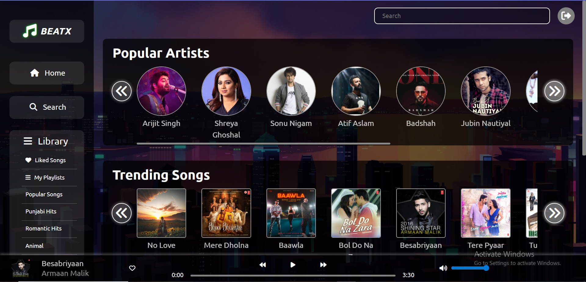
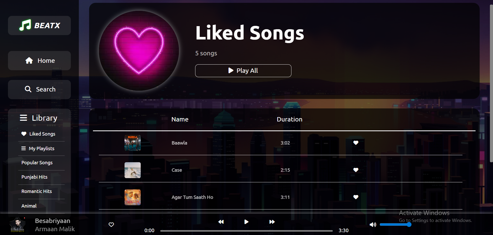
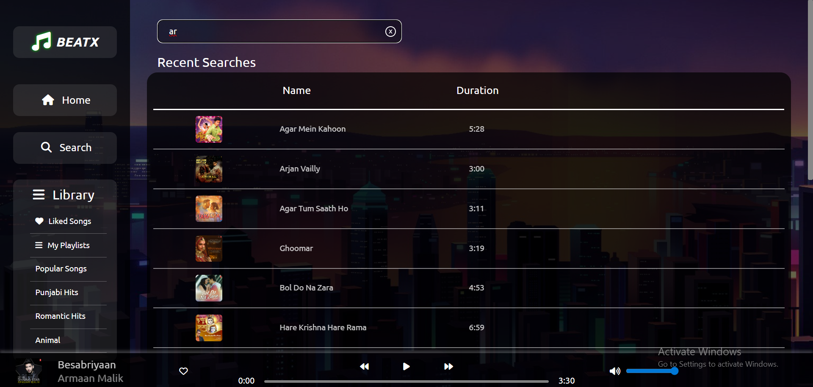
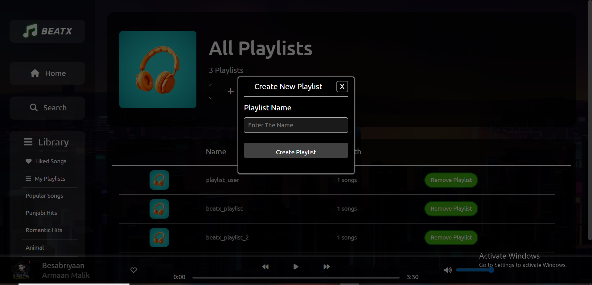

# BeatX 3.0 🎵
A MERN-based media streaming prototype built to demonstrate clean code practices, modular architecture, and efficient development workflows. Includes JWT authentication, Redux state management, and a normalized MongoDB schema for songs, playlists, likes, and users.

---
## ScreenShots
### Home Page

### Liked Page

### Search Page

### Playlist Page

---

## 🚀 Tech Stack
**Frontend:** React, Redux, HTML, CSS  
**Backend:** Node.js, Express.js  
**Database:** MongoDB (with join-style collections)  
**Other Tools:** Python (for dataset generation), JWT, bcrypt

---

## ✨ Features
- Secure JWT-based authentication
- Redux for global state management
- Public and private playlists
- Liked songs and recently played tracking
- Seeded database with realistic music data using Python scripts
